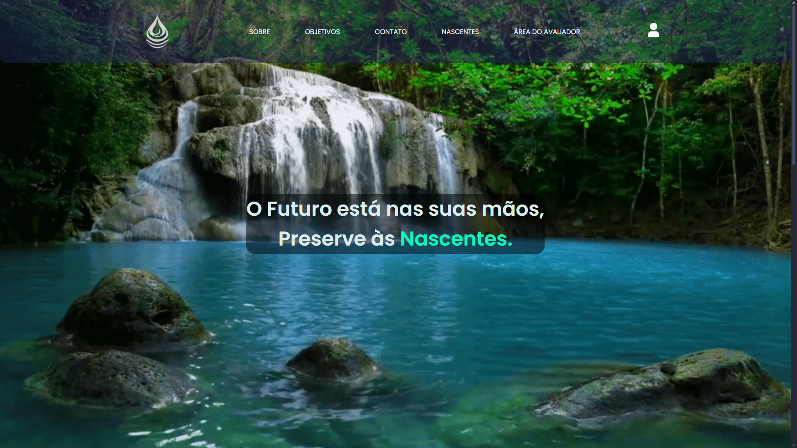
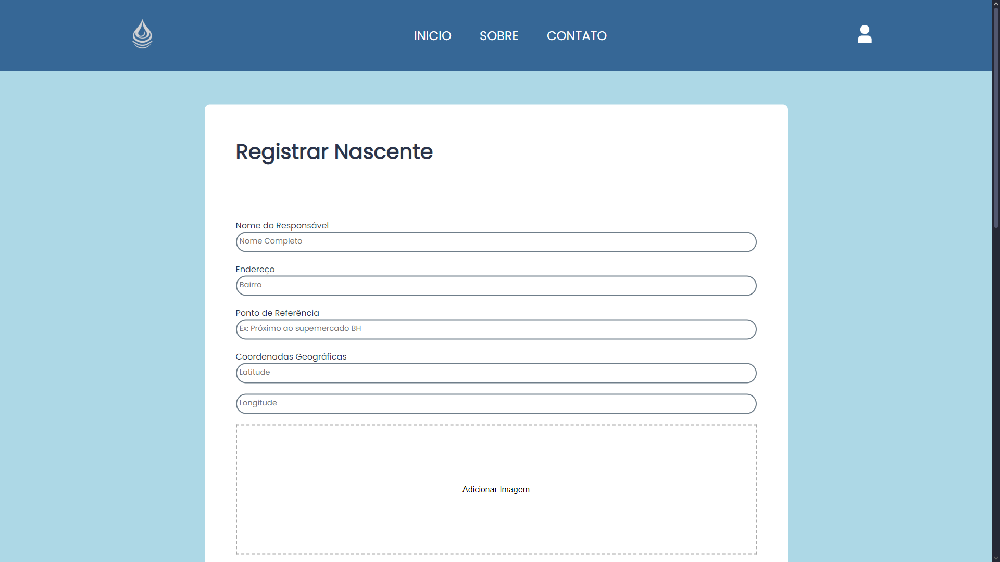
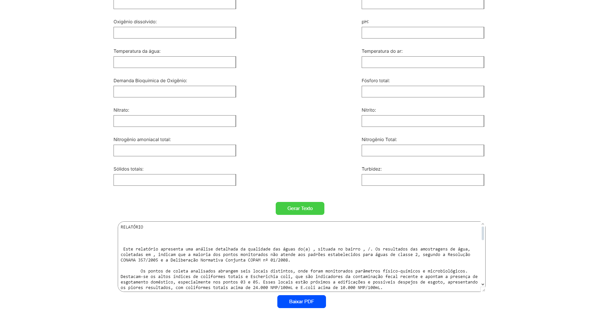

<h1>Ecolizar</h1>
  

## Tópicos

 • <a href="#-sobre-o-projeto">Sobre o Projeto</a>  
 • <a href="#-tecnologias">Tecnologias</a>  
 • <a href="#-layout">Layout</a>  
 • <a href="#-funcionalidades">Funcionalidades</a>  
 • <a href="#-autor">Autor</a>  
 • <a href="#user-content--licença">Licença</a> 

## Sobre o projeto  

O Ecolizar foi um projeto inovador que unia tecnologia e sustentabilidade para monitoramento e preservação ambiental. Ele utilizava sensores inteligentes para coletar dados sobre parâmetros ambientais, como qualidade da água, temperatura e umidade, e os enviava para uma plataforma digital, permitindo análise e tomada de decisões mais eficazes.

Com essa abordagem, o projeto visava contribuir para a conscientização ecológica e o uso inteligente de recursos naturais, podendo ser aplicado em diversos contextos, como monitoramento de rios, lagos e áreas florestais.

Além disso, o Ecolizar tinha um grande potencial educacional, ajudando estudantes e pesquisadores a compreenderem melhor os impactos ambientais e incentivando soluções tecnológicas para problemas ambientais. 🌱💡🚀

## Tecnologias
🔹 Front-end   
▪ HTML5 → Estrutura da interface. 
▪ CSS3 → Estilização e design responsivo. 
▪ JavaScript → Interatividade e dinamismo. 
▪ Figma → Protótipo e design da interface.  
🔹 Back-end   
▪ Node.js → Lógica do servidor e processamento de dados. 
▪ Express.js → Framework para criar APIs e rotas de forma eficiente. 
▪ Firebase → Autenticação de usuários e armazenamento em tempo real. 

🔹 IoT e Hardware   
▪ Arduino → Sensores para coleta de dados ambientais. 
▪ Python → Processamento de dados e integração com APIs. 

## Layout

💻 Algumas telas da Aplicação Web!

  

  <h2 align=center> Home </h2>
  
  <h2 align=center>Registrar Nascente</h2>
  
  <h2 align=center>Gerar Relatório/pdf</h2>
  

## Funcionalidades

🌱 Monitoramento Ambiental   
▪ Coleta de dados sobre qualidade do ar, umidade e temperatura usando sensores conectados a uma placa Arduino.  
▪ Exibição dos dados em tempo real em um painel interativo.    

🔎 Análise e Relatórios    
▪ Gráficos e estatísticas sobre os parâmetros ambientais monitorados.  
▪ Possibilidade de visualizar histórico de medições para acompanhamento de tendências.   

📢 Alertas Inteligentes   
▪ Notificações automáticas caso os níveis de poluição ou temperatura estejam fora do padrão seguro.  
▪ Sugestões de ações sustentáveis com base nos dados coletados.   

🛠 Gerenciamento de Usuários   
▪ Login e autenticação usando Firebase para acesso seguro.  
▪ Diferentes perfis de usuário (administradores e observadores).  

# Entre em contato

**Linkedin**: [LinkedIn](https://www.linkedin.com/in/jonathan-rubens-60975628a/)

Desenvolvido por **Jonathan Rubens** 👋🏻
